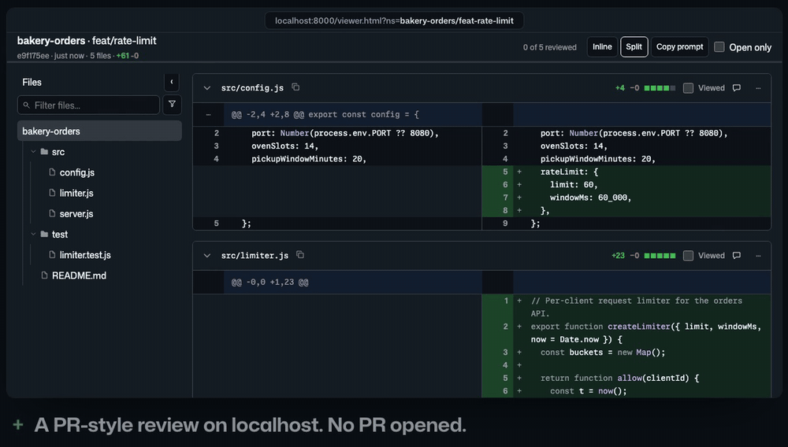

<h1>
  <picture>
    <source media="(prefers-color-scheme: dark)" srcset="../../assets/hunkboard-logo-dark.png">
    
  </picture>
</h1>

Review what your coding agent changed like a pull request, before you open one, on your laptop
or your phone, and hand your comments back to it.

Your agent finishes a task. To see what it did, you open an editor and read raw diffs, push a
draft pull request just to read it, or ask it for a summary and trust it. hunkboard turns the branch into a GitHub-style review page
instead: side by side or inline, syntax-coloured, with a file tree and a "viewed" tick per
file. Comment on any line; the agent picks the comments up, fixes the code or answers, and
shows you the next round.

No database, no account, no service to run: one static page and three JSON files.



With a board server, comments save from any device and the agent's answers show under them:
[watch the full 50-second demo](https://github.com/bochengyang/skills/releases/download/hunkboard-v0.1.0/hunkboard-demo.mp4) (MP4).

## Installation (30-second setup)

Install the skills into your agent. That is all: the first time the agent uses them, it fetches
the tool itself (it needs `git` and `jq`).

<details>
<summary><strong>Claude Code</strong></summary>

```
/plugin marketplace add bochengyang/skills
/plugin install hunkboard
```

</details>

<details>
<summary><strong>Codex, Gemini CLI, Cursor and other agents</strong></summary>

```
npx skills@latest add bochengyang/skills --skill hunkboard-publish --skill hunkboard-comments
```

</details>

## Use it

1. **Ask your agent to show you the changes** (`/hunkboard:hunkboard-publish` in Claude Code).
   It opens the board and gives you a URL.
2. **Review.** Tap a line number to comment; shift-tap a second one for a range.
3. **Hand it back.** Tell the agent you are done. Without a server, press **Copy prompt** on
   the board and paste the text; with one, the agent reads your comments from it. It works
   through each thread, then shows you the new diff with its answers under your comments.

The review survives the work moving on. The diff is measured from where the branch left
`main`, like a pull request, so committing does not reset it. Each comment remembers the code
it was written on; when that code changes, the thread is marked **Outdated** instead of
pointing at whatever now sits on that line.

## Review from anywhere

Without a server, the board runs on your machine and comments come back as pasted text. To
open it from your phone wherever you are and save comments from the page, put it on any static
server that accepts `PUT` on `comments.json`: see the [nginx example](examples/nginx/hunkboard.conf)
(authentication, compression and the write rule included). Then tell the skills where it is:

```sh
export HUNKBOARD_REMOTE=review-box                        # ssh host alias
export HUNKBOARD_ROOT=/srv/hunkboard                      # directory on that host
export HUNKBOARD_URL=https://review.example.com/hunkboard # public base, prefix included
```

The board contains your source code. Always put it behind authentication and TLS.

## How it works

```
Mac / dev box                       static web server               phone / tablet
─────────────                       ─────────────────               ──────────────
git working tree                    /viewer.html                    viewer.html
  │ hunkboard-publish                 /<repo>/<branch>/               │ renders diff.json
  ▼                                     diff.json         ◀────────── │ PUTs comments.json
diff.json ── scp/rsync ──────────▶      comments.json     ◀────────── │
                                        resolutions.json ◀── agent writes, then pushes
```

Three files, each with exactly one writer:

| File | Written by | Read by |
|---|---|---|
| `diff.json` | `hunkboard-publish` | viewer |
| `comments.json` | viewer (HTTP PUT) | agent, viewer |
| `resolutions.json` | agent | viewer |

Schemas live in [`schema/`](schema/).

## Reference

`bin/hunkboard-publish` — working tree → `diff.json`

| Flag | Default | Meaning |
|---|---|---|
| `--out DIR` | required | directory that receives `diff.json` (written atomically) |
| `--repo NAME` | basename of the git toplevel | namespace segment 1 |
| `--branch NAME` | current branch | namespace segment 2 (`/` becomes `-` when pushed) |
| `--base REV` | where the branch left `main`/`master` (`HEAD` on the default branch) | revision to diff against — like a pull request, so commits and amends on the branch do not move the diff or the threads anchored to it |
| `--no-untracked` | off | leave untracked files out (by default they are included via a temporary index, honouring `.gitignore`) |
| `--max-file-bytes N` | `512000` | files larger than this keep their hunks but not their full contents |

Prints the absolute path of `diff.json`. Never touches the real index or working tree.

`bin/hunkboard-push` — copy a round to the server

| Flag | Default | Meaning |
|---|---|---|
| `--from DIR` | required | directory containing `diff.json` (and `resolutions.json` if the agent wrote one) |
| `--remote HOST` | `$HUNKBOARD_REMOTE` | ssh host or alias |
| `--root PATH` | `$HUNKBOARD_ROOT` | web root on the server |
| `--repo`, `--branch` | from `diff.json` | override the namespace |
| `--viewer FILE` | none | also upload the shared `viewer.html` to the root |
| `--dry-run` | off | print the `ssh`/`scp` commands instead of running them |

`comments.json` is never pushed: the server copy is the reviewer's, written by the viewer.

`bin/build` — assemble `dist/viewer.html` from `src/` and `vendor/` (POSIX sh, no dependencies).

The viewer is one self-contained file. Its fonts, Mona Sans VF and Monaspace Neon, load from
pinned jsDelivr CDNs (`github/mona-sans@v2.0.27`, `githubnext/monaspace@v1.400`) and fall back
to system fonts when unreachable.

## Development

```sh
npm test          # node --test, fixtures are real git output in test/fixtures
sh bin/build      # concatenates src/ and vendor/ into dist/viewer.html (same as npm run build)
```

## License

MIT. Embedded third-party code is listed in [`THIRD_PARTY_LICENSES.md`](THIRD_PARTY_LICENSES.md).
